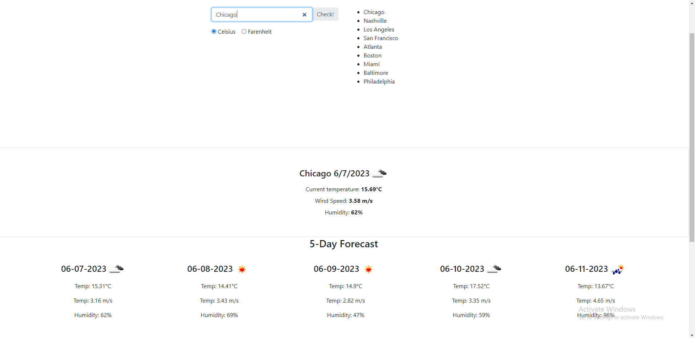

# Weather-Retrieval-Dashboard

## Description

We are using a server side API to create an application for users to retrieve weather data from user inputted cities. Users will be able to see a 5 day forecast and the current day's weather in a very accessible format. This helped me learn how to use server side API's and dayjs as well.

## Table of Contents (Optional)

N/A
## Installation

N/A

## Usage

Input a city into the search bar. Pressing enter or clicking the button will pull up the current day's weather as well as the forecast for the next 5 days. The webpage will also keep track of searches that you've already made.

## Credits

N/A

## License

Please refer to the license provided in the github repository.